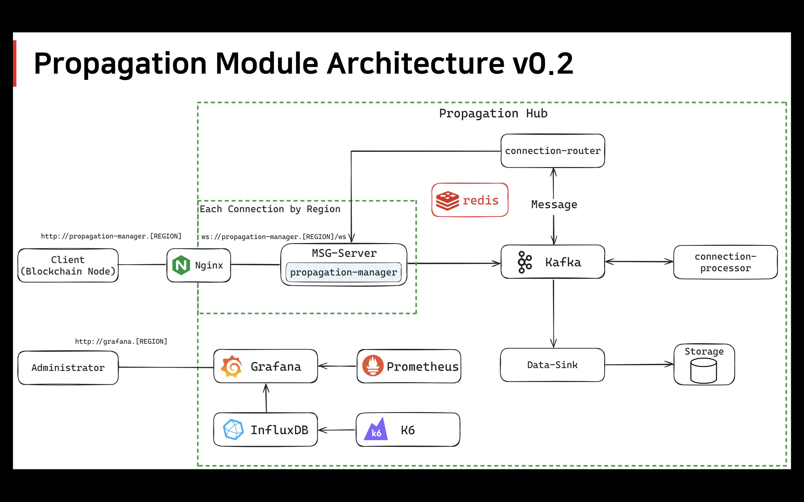

# Propagation Module

- **아키텍처**
    
    
     
    
- **고려사항**
    
    > **여기서 범용성이라는 것은 해당 Propagation System이 특정 시스템만을 위해 존재하는 Propagation System이 아니라는 것을 의미**
    > 
    1. 범용적인 전파 모듈로의 개발을 하기 위해서는 특정 블록체인의 피어가 해당 모듈과의 연결을 시도할 때 등록하는 과정이 있어야 하지 않을까?
        1. Connection Token 발행
            
            일단 보류
            
    2. Data-Sink 모듈의 경우, 블록체인 네트워크 내에서 Validator 노드가 검증이 완료되었을 때 해당 블록을 영구 저장하는 것이 가장 합리적이기 때문에 전파 시점에서 저장을 해야하는가에 대한 의문이 존재
        
        → 블록 검증이 다 되어서, 전파가 완료되었을 때 리더 노드가 블록을 허브로 제공하는 것이 합리적인게 아닐까?
        
    

---

### 1. 개발 언어

→ Golang

### 2. Framework

→ Go Fiber https://github.com/gofiber/fiber

### 3. Msg (Block Data) 처리 방식

→ WebSocket 

[Go Fiber WebSocket Github](https://github.com/gofiber/contrib/tree/main/websocket)

[Go Fiber WebSocket Docs,](https://docs.gofiber.io/contrib/websocket/) [Example](https://github.com/gofiber/recipes/tree/master/websocket-chat)

### 4. Message Broker

→ Apache Kafka

1. https://github.com/confluentinc/confluent-kafka-go - ⭐️ 4.3K
2. https://github.com/segmentio/kafka-go - ⭐️ 7K
3. **https://github.com/IBM/sarama - ⭐️ 10.8K (이거 사용)**
    
    → [Example1](https://codesk.tistory.com/86), [Example2](https://velog.io/@divan/Shopifysarama-kafka-%ED%85%8C%EC%8A%A4%ED%8A%B8), [Example3](https://github.com/IBM/sarama/tree/main/examples), [Example4](https://codesk.tistory.com/89), [Example5](https://medium.com/@moabbas.ch/effective-kafka-consumption-in-golang-a-comprehensive-guide-aac54b5b79f0)